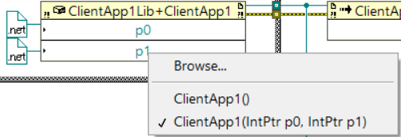

# client  

 TCP, Client, LabVIEW, OOP, DLL

Published as Example to NI Forums and described in more detail at <a href="https://forums.ni.com/t5/Example-Code/Reusing-NET-Interop-Assembly-with-LVOOP-in-LabVIEW/ta-p/4072423">Reusing .NET Interop Assembly with LVOOP in LabVIEW - Example Code in NI's Community</a>.

### Project Overview

### Snippets

#### Test Read - LabVIEW Classes, LVOOP 
  
  

#### Test Read - Interop Assembly (.NET DLL), LVOOP  
 

### Testing constructors  

An alternative to the constructor that uses pointers is creating and exporting a VI that provides a valid, non-initialized class reference which will be initialized in the Create.vi.  
This proved very useful in a situations where you cannot use the .NET FormatterServices GetUninitializedObject Method of mscorlib.dll to instantiate a new object without calling its constructors.  
  

Note: For more on the constructor node issue in VS see <a href="https://github.com/etfovac/dll/issues/2#issue-673036198">'new' triggers browsing to lvclass file on disk</a>

## Download
Download the latest [release here][0].

[0]: https://github.com/etfovac/client/releases
